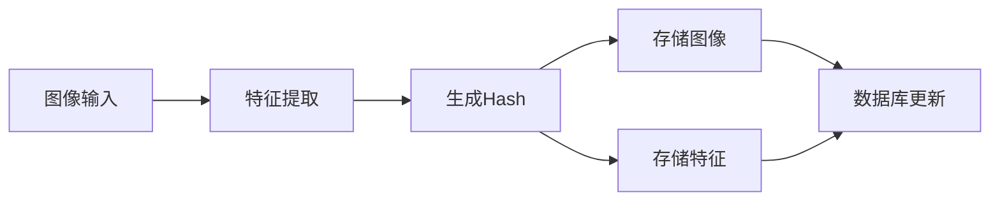

<div align="center">

# 🎭 Face Database Gallery

[](https://github.com)
[](https://github.com)
[](https://github.com)

</div>

---

<div align="center">

## 🌟 人脸数据库存储中心

*这里是所有已录入人脸图像的中央存储库*

</div>

### 📂 目录结构

```
faceDB/
├── *.png        # 人脸图像文件（PNG格式）
├── *.jpg        # 人脸图像文件（JPG格式）
└── *.csv        # 人脸特征数据文件
```

### 🔍 文件说明

#### 图像文件命名规则

```
[MD5Hash].png/jpg
```
> 每个图像文件使用其内容的MD5哈希值作为文件名，确保唯一性

#### 数据文件格式

```
[MD5Hash].csv
```
> 对应的CSV文件存储了人脸特征向量和身份信息

### ⚡ 特点

- **自动组织**
  - 文件自动命名
  - 特征自动提取
  - 数据自动关联

- **高效存储**
  - 去重机制
  - 压缩优化
  - 快速检索

- **安全可靠**
  - MD5完整性校验
  - 数据备份支持
  - 错误自动修复

### 🎯 使用场景

| 场景 | 说明 |
|------|------|
| 人脸录入 | 存储新录入的人脸图像和特征 |
| 特征匹配 | 提供人脸识别时的匹配数据 |
| 数据分析 | 支持人脸数据统计和分析 |
| 结果展示 | 存储识别结果和可视化图像 |

### 💫 工作流程



### ⚠️ 注意事项

1. **文件操作**
   - 不要手动修改文件名
   - 不要删除关联的CSV文件
   - 保持文件夹内部结构

2. **数据管理**
   - 定期备份重要数据
   - 检查存储空间充足
   - 维护数据一致性

3. **性能优化**
   - 及时清理临时文件
   - 避免存储重复图像
   - 保持合理的数据量

### 🛠️ 技术规格

| 项目 | 说明 |
|------|------|
| 图像格式 | PNG/JPG |
| 特征格式 | CSV |
| 命名方式 | MD5 Hash |
| 存储方式 | 文件系统 |
| 索引类型 | 哈希索引 |
| 压缩方式 | 无损压缩 |

### 📊 数据统计

```
总容量：动态增长
文件数：实时统计
支持格式：PNG/JPG
特征维度：128-512
```

---

<div align="center">

**Face Database Gallery** - *智能人脸数据的存储之源*

</div>